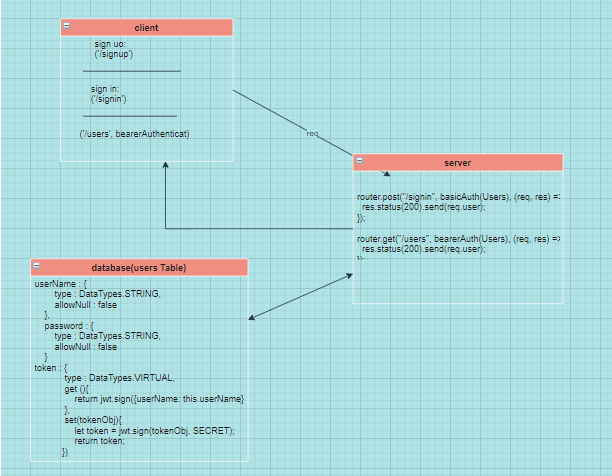

# bearer-auth
* LAB - 06 BASIC AUTH
* Author: Maram Abu Murad
* [Heroku link](https://maram-bearer-auth.herokuapp.com/)
* Setup .env requirements PORT - 3000
* Running the app npm index.js
* Endpoint: /signin /signup /users Endpoint : '*' returns ERROR * 'Page NOT FOUND.' Endpoint : /badConnection Returns Object { "error": 500, "path": "/badConnection", "message": "Something WENT WRONG Internal Server Error" }
* Test npm test 
* 